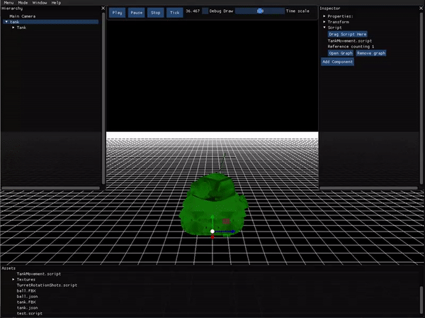
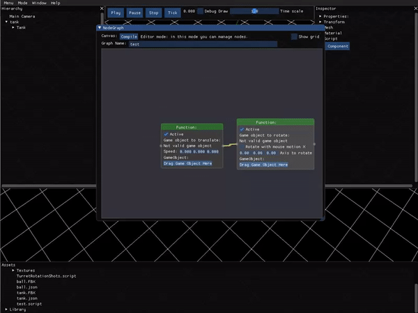

# FeLiNa Engine

This engine have been developed in the design & development grade of CITM (Terrasa).

The objective is to develop a engine to use it in the next game we'll create. 

The code is written in c++ 

### Tool used

-IDE: Mircrosoft Visual Studio 2017.
-SDL 2.0.4 
-OpenGl 3.1.0
-Parson 0.94 
-Pcg
-Devil 1.7.8
-Glew 2.3.4
-Assimp 3.3.0
-ImGui 1.65
-MathGeoLib 1.5

## Team members

[Alex Campamar Redol](https://github.com/Acaree)

- Own files format
- OpenGL drawing implementation
- Guizmos implementation
- Profiling
- Game mode
- Visual scripting

[Alfonso Sánchez-Cortés Puerta](https://github.com/Siitoo)

- Scene serialization
- Game objects & components
- Frustrum & camera culling
- Mouse picking
- Resource Manager
- Visual scripting

## Main sub-systems

Our engine contain the next sub-systems:

### Game objects & components

A game objects system with his components. There are 6 avaliable components: transform, mesh, material, script, speed and camera. Game objects also have hierarchy implemented

Double click on fbx in assets folder to add to scene the game object and his hierarchy. An empty game object can also be created right-clicking in hierarchy. If a game object is selected with left click or clicking it in the world, his inspector will be opened. In inspector you can find a button to add components to the selected a game object. All components can be edited opening his own menu in inspector.

### Profiling

In configuration window (to open it, use shift+M or go to window->configuration) you can find a lot of editable things and some modules update time in a graphic with the ms it take per frame. This graphics can be stopped (they will stop filling with new frames).

### Scene serialization 

The scene can be saved in menu->save scene. The scene will be serialized also in menu->load scene. Scene is also saved when game is played. When a scene is loaded, the current hierarchy it's lost and the one saved is setted.

### Frustum camera & culling

The engine have 2 cameras: the game camera (main camera in hierarchy) and the engine camera. This cameras work with a frustrum editable. The game camera can be edited in inspector, editing his camera component. To edit the engine camera, go to Window->configuration->Camera. Here you can choose the near and far plane from frustrum position, the FOV and activate or desactivate frustrum culling.

Camera culling is used to discard some geometry draw. Every mesh have an AABB and if it's outside camera frustum is not drew. Static objects are accelerated using a queadtree. If a static object is outside quadtree is not tested against camera culling.

### Mouse picking

When screen is clicked, a ray is casted from mouse to the far plane of camera frustrum. All objects that intersect with that ray are tested and the nearest to near plane for frustrum is picked. When an object is picked, it's selected in inspector and his guizmos appear.

### Game mode

The engine have a game mode. This game is activated when Play button is pressed and stop button back to engine mode. When game mode is on, camera will be changed to Main Camera, all scripts will be executed and every change on scene will be reseted when stop is clicked. Pause button pauses the game mode. Time scale modify the time multiplier for game mode. Tick run the game one frame and stop it. 

### Resource manager

Resource manager is used to optimize the memory consumption. It's used for component mesh, material and script. It's used to save only one time all data from this component (for example, in mesh, save the triangles position, the normals...). Components only save the UID from this resource. You can see how many things use a resource in inspector. Open a component and see his reference counting. This resource generate an own format file saving his data.

### Own format files & importers

When a file is imported (dragging it into the engine or assets folder & opening engine or clicking refresh assets) our own format files for that files will be generated in library folder. The importers save the data of that in 2 types of file: .felina files for meshes and .dds for textures. There are saved all useful data for load that mesh or texture. A .meta file is also generated for every FBX or texture to link it with his files in our own format. With this, whenever a file is charged in scene, the engine will look the .meta and charge the own format file, to make it faster. This own files can be dragged into a component mesh or component material. 

## Visual scripting system

We implement a visual scripting system based on Unreal engine blueprints. Our system have two types of node:

### Event nodes
Input nodes activates action nodes when an event happen. We implemented 3 types: keyboard button, mouse button and mouse motion

- **Keyboard:** The keyboard node can be configurable to be activated with any key. While key is pressed is active.
- **Mouse button:** Same as keyboard with mouse buttons. Configurable to react to left click, right click or mouse wheel click.
- **Mouse Motion:** This node is activated when mouse is moved. To activate, the mouse movement have to be inside engine window.

### Action nodes
The action nodes execute an actions. It only can be activated by an event node or another action event previously activated.
Currently, there are 3 types: translate, rotate and instatiate.

- **Translate:** The translate node move the dropped game object the quantity introduced everytime it's activated.
- **Rotate:** This node rotate a game object a quantity specified. It also can follow the mouse motion in x to rotate.
- **Instatiate** This node create an instance of one FBX in a spicified position. This position can be copied from a game object dragging it into the node. Also add a component speed to the instance. This component is calculated with an axis and a velocity. The axis can rotate following a game object rotation dragging it into the node. When axis is calculated depending on the game object rotation, any axis (x, y and z) can be ignored.

At top of screen you'll se three things. Compile button save the script. If show grid is marked, grid will appear. The input box change the name of the script in assets folder. 

Nodes also have an **active button**. If active is not marked, the node will be disable, like if game mode is off.

If **CTRL + V** is pressed while a node is hovered, this node will be duplicate.

**Right click** when mouse is over a node to open a new pop up menu. This menu only have one option to delete nodes.

if **right click** is not over a node, another pop up will appear, now whith "add" button. This open a menu to select the typw of node you want and create it.

## Video
<iframe width="1105" height="829" src="https://www.youtube.com/embed/88vKE41czsU" frameborder="0" allow="accelerometer; autoplay; encrypted-media; gyroscope; picture-in-picture" allowfullscreen></iframe>

### Link to the [repository](https://github.com/Acaree/FeLiNa-Engine)
### Download the last release [here](https://github.com/Acaree/FeLiNa-Engine/releases/tag/3.0)

## License 

Copyright 2018 MIT Alex Campamar & Alfonso Sánchez-Cortés
Permission is hereby granted, free of charge, to any person obtaining a copy of this software and associated documentation files 
FeLiNa, to deal in the Software without restriction, including without limitation the rights to use, copy, modify, merge, 
publish, distribute, sublicense, and/or sell copies of the Software, and to permit persons to whom the Software is furnished to do so, 
subject to the following conditions:

The above copyright notice and this permission notice shall be included in all copies or substantial portions of the Software.

THE SOFTWARE IS PROVIDED "AS IS", WITHOUT WARRANTY OF ANY KIND, EXPRESS OR IMPLIED, INCLUDING BUT NOT LIMITED TO THE WARRANTIES OF MERCHANTABILITY, 
FITNESS FOR A PARTICULAR PURPOSE AND NONINFRINGEMENT. IN NO EVENT SHALL THE AUTHORS OR COPYRIGHT HOLDERS BE LIABLE FOR ANY CLAIM, 
DAMAGES OR OTHER LIABILITY, WHETHER IN AN ACTION OF CONTRACT, TORT OR OTHERWISE, ARISING FROM, OUT OF OR IN CONNECTION WITH THE SOFTWARE OR THE USE 
OR OTHER DEALINGS IN THE SOFTWARE.

